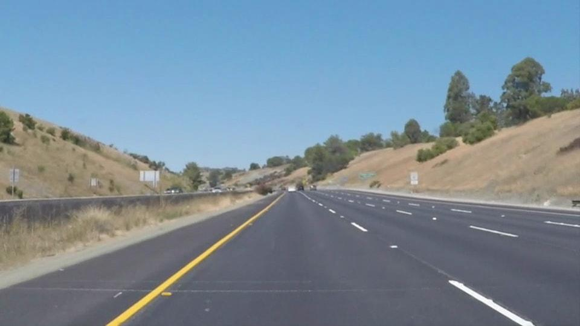
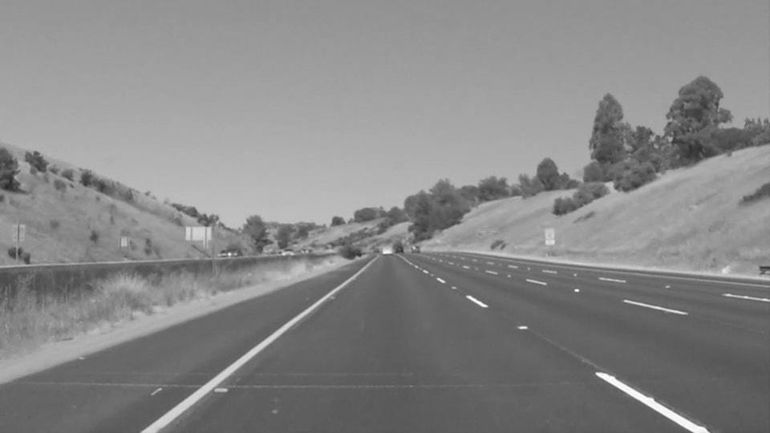
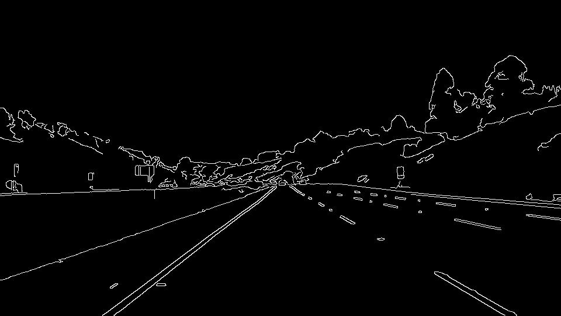
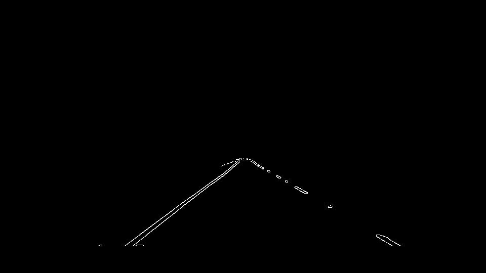
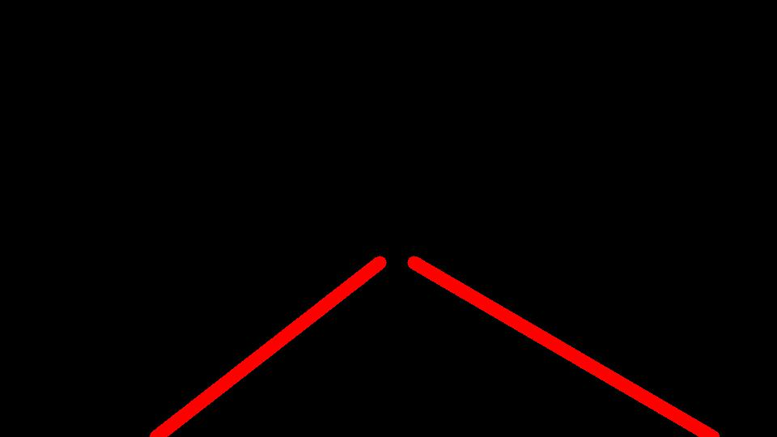
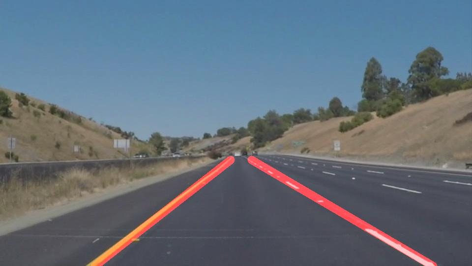

# **Finding Lane Lines on the Road** 

## By Marwan ZOUINKHI 06/01/2017

---

**Finding Lane Lines on the Road**

The goals / steps of this project are the following:
* Make a pipeline that finds lane lines on the road
* Reflect on your work in a written report

[image7]: ./examples/weighted.jpg "Final Image"

---

### Reflection

### 1. Describe your pipeline. As part of the description, explain how you modified the draw_lines() function.

My pipeline consisted of 5 steps. First, I converted the images to grayscale, then I applyed a Gaussian blur to the image to avoid the unnecessary objects. The third step was applying Canny edge detection to detect the limits of objects.
After that, i maked a region regression to specify the the region of interest in processing.
Just after, i runned the Hough transform to identify lines and i converted them into straight lines. 
Also, I smoothed the result with a moving average filter. and lastly i plotted the lines on top of the image

In order to draw a single line on the left and right lanes, I modified the draw_lines() function by applying an algorithm who aim to create continuous right and left lines following this steps:
For the one thing, classify lines in two listes, right one and left one, by slope. secondly, for each line calculate current slope and intercept. after finishing etirate lines listes, calculate the global slope and intercept and get the values of x for extremes y. after, concatinate them to get the full two lines
and finally, Draw extrapolated line

If you'd like to include images to show how the pipeline works, here is how to include an image: 

### 2. Identify potential shortcomings with your current pipeline

One potential shortcoming would be cleaner code and avoid tweaking 

Another shortcoming could be when changind the statics values by dynamics

### 3. Suggest possible improvements to your pipeline

A possible improvement would be to adabte the effects to avoid to light and contrast change bit more 

Another potential improvement could be including machine learning to our algorithm
